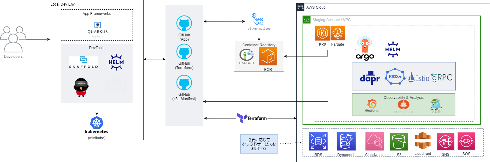

# nautible

## nautible概要

* nautibleの目的
  * Kubernetes(k8s)を基盤としたマイクロサービスアプリケーションの環境構築及び開発手法を容易にするテンプレートを準備することで、開発・導入スピードを向上させる。
  * 主要なエコシステム、開発フレームワークなどを事前に選定することで、開発コスト及び学習コストの低減、開発手順・運用手順に関するナレッジの蓄積・共有を図る。

* 技術スタック
  
nautibleの技術スタックを適用することで、以下のような開発の流れを実現します。
  * ローカルでSkaffold/Helm/Telepresenceを利用して開発し、必要に応じてminikubeにデプロイして動作確認
  * Java/Quarkusを用いたアプリケーションの実装
  * SCMにGitHubを使用し、GitHub ActionsでCIを実施
  * ビルドしたコンテナイメージをECRで管理
  * Terraformを利用してk8sを中心としたパブリッククラウドのインフラを構築
  * ArgoCDを利用してアプリケーションや周辺エコシステムをデプロイ
  * RDBなど必要に応じてパブリッククラウドのマネージドサービスを活用

 

  | カテゴリ | 組み込んでいるプロダクト |
  | ---- | ---- |
  | コンテナ化 | <ul><li>Docker</li></ul> |
  | CI/CD | <ul><li>ArgoCD</li><li>GitHub Actions</li></ul> |
  | オーケストレーション | <ul><li>Amazon EKS</li><li>Azure AKS</li></ul> |
  | 可観測性・分析 | <ul><li>prometheus</li><li>Grafana</li></ul> |
  | プロキシ・サービスメッシュ | <ul><li>Istio</li></ul> |
  | ネットワーク・セキュリティ | <ul><li>T.B.D</li></ul> |
  | データベース・ストレージ | <ul><li>T.B.D</li></ul> |
  | ストリーミング・メッセージング | <ul><li>T.B.D</li></ul> |
  | コンテナレジストリ | <ul><li>Amazon ECR</li></ul> |
  | ソフトウェアアップデート | <ul><li>T.B.D</li></ul> |

  nautibleは利用者の目的や状況に合わせて様々な活用方法があります。

  * Kubernetesやマイクロサービスの技術検証/学習
    * ゼロから環境構築することなく、目的に応じたプロトタイプ実装を組み込んで動かすことができます
    * リファレンスアプリケーションの付帯ドキュメントや実装を通じて、マイクロサービスアーキテクチャ特有の方式設計を学習できます
  * 開発をスタートする際の雛型
    * リファレンスアプリケーションをコピーすることで、素早く実装を開始できます
    * nautibleを「そのまま」使用する必要はありません。使用しないものを削除する・プロジェクトで必要なもの追加するなど、カスタマイズ可能です

## 利用シナリオ
nautibleを使用する際は以下の段取りで適用します。各ポイントで目的・用途・状況に応じてカスタマイズを実施してください。

1. nautibleのclone
   - nautibleはソースコード（gitリポジトリ）で提供します
   - このソースコードに対し、利用目的に応じたカスタマイズを実施してください 
2. Kubernetesクラスタ等のインフラ構築
   - nautibleはTerraformによるInfrastructure as Code実装を提供しています
   - GitHub Actionsから実行し、リファレンスアプリケーションの動作環境を構築してください
3. CI/CD環境の構築
   - nautibleはArgoCDによるGitOpsの実装を提供しています
   - ArgoCDをKubernetesクラスタにデプロイし、リファレンスアプリケーションをデプロイできるよう構成してください
4. リファレンスアプリケーションのデプロイ
   - nautibleはマイクロサービスアプリケーションのリファレンス実装を提供しています
   - ソースコードを修正してGitHubへPushすることで、ArgoCDが自動でデプロイを行います
5. リファレンスアプリケーションの学習
   - nautibleが提供するリファレンスアプリケーションには、「トランザクション管理」や「サービス間通信」などのマイクロサービスアーキテクチャを実現するノウハウが実装されています
   - これらを学習することで、マイクロサービスアーキテクチャを設計・実装できるようになります

## リポジトリ構成
nautibleは以下のリポジトリを公開しています。必要なリポジトリをgit cloneしてください。

<table>
  <thead>
    <tr>
      <th>カテゴリ</th>
      <th>リポジトリ名</th>
      <th>内容物</th>
      <th>備考</th>
    </tr>
  </thead>
  <tbody>
    <tr>
      <td>インフラ構築</td>
      <td>nautible-infra</td>
      <td><ul><li>Infrastructure as Codeの実装</li></ul></td>
      <td><ul><li>クラウド上にKubernetesクラスタを構築します</li></ul></td>
    </tr>
    <tr>
      <td>エコシステム・アプリケーションの導入</td>
      <td>nautible-plugin</td>
      <td><ul><li>エコシステム・アプリケーション導入用マニフェストファイル</li></ul></td>
      <td><ul><li>EKS上にエコシステムやサンプルアプリケーションを導入します</li></ul></td>
    </tr>
    <tr>
      <td>リファレンスアプリケーション</td>
      <td colspan="2">明細は<a href="../referenceapp-architecture/README.md">リファレンスアプリケーションの概要とアーキテクチャ</a>を参照</td>
      <td><ul><li>マイクロサービスアプリケーションのリファレンス実装です</li><li>トランザクション管理やサービス間通信などの例を「注文サービス」「商品サービス」等を通じて例示します</li></ul></td>
    </tr>
    <tr>
      <td>リファレンスアプリケーション フロントエンド</td>
      <td>nautible-front</td>
      <td><ul><li>リファレンスアプリケーションを呼び出すUI</li></ul></td>
      <td><ul><li>リファレンスアプリケーションの動作確認用に実装されたものであり、妥当性ある設計・実装が施されたものではありません</li></ul></td>
    </tr>
  </tbody>
</table>

## License
nautibleは「Apache License 2.0」です。