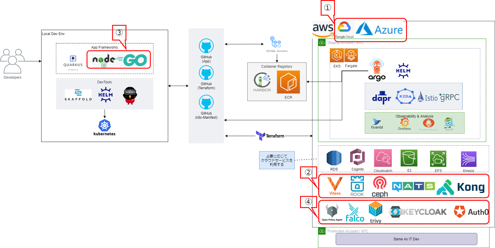

# マイルストーン
## nautibleの今後の取り組みについて
2021年度の主な取り組みは以下の4点

* アーキテクチャイメージ

- ①. AWS以外のクラウドに対応
- ②. クラウドに依存しないエコシステムへの対応
- ③. リファレンス実装の対応言語の追加
- ④. 認証認可、セキュリティ機能の対応

## リリーススケジュール
マイクロサービスにかかわる新たな技術が続々と公開される続ける中、nautibleは新たな技術を随時検証・取り入れることで成長し続ける計画です。既存コードの修正・機能追加、個別のエコシステムの追加など影響の大きくない内容については随時リリースして行く予定です。

## 注意点
- Azureの対応状況について  
現時点ではAzure関連の対応作業を進めている状況ですが、一部のリポジトリには既にAzureに関連するコードが反映されています。今後もAzureの対応作業を進めるため、既存のAzure関連のコードが変更される可能性があります。