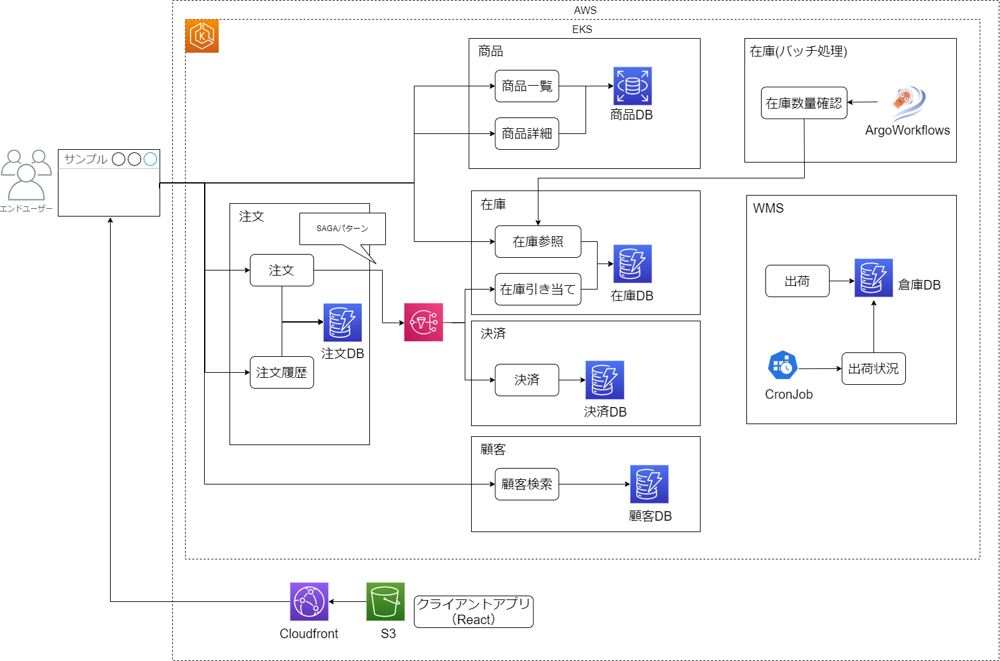

# リファレンスアプリケーション共通
このドキュメントには各種リファレンスアプリケーション共通の内容について記載する。
Quarkusアプリケーション共通の内容については[こちら](../quarkus/README.md)を参照。
アプリケーションでDaprを利用する場合の共通の内容については[こちら](../dapr/README.md)を参照。
各アプリ固有の内容については各リポジトリのドキュメントを参照すること。

## リファレンスアプリケーション構成イメージ

