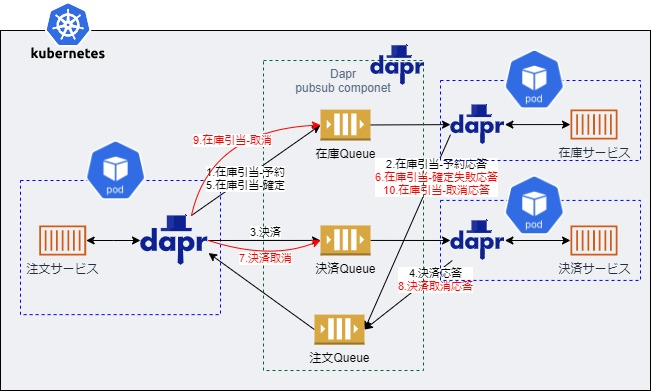
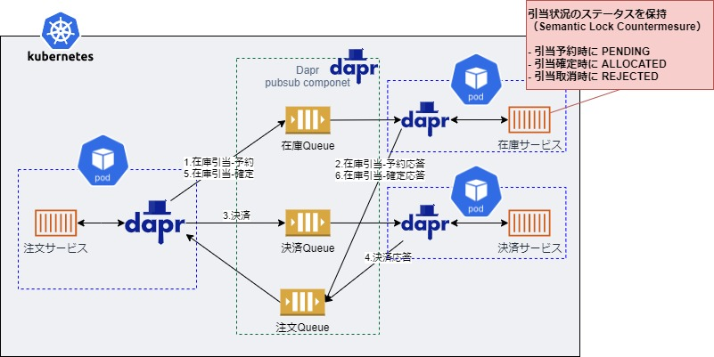

# ■ リファレンスアプリケーションにおけるトランザクション管理

リファレンスアプリケーションでは、マイクロサービス間のトランザクション管理に [saga pattern](https://microservices.io/patterns/data/saga.html) を取り入れている。
また、saga pattern のうち、オーケストレーションサーガを採用している。

## ▽ オーケストレーションサーガ
注文サービスがコーディネータとなり、サービス連携の制御を行う。

* 注文サービスが注文要求を受付、注文情報を管理（永続化）する。
* 注文サービスは、在庫サービスに在庫引当-予約の処理依頼を行う。
* 在庫サービスは、在庫引当-予約の処理結果を通知する。
* 注文サービスは、決済サービスに決済処理依頼を行う。
* 決済サービスは、決済処理の処理結果を通知する。
* 注文サービスは、在庫サービスに在庫引当-確定の処理依頼を行う。
* 在庫サービスは、在庫引当-確定の処理結果を通知する。
* 注文サービスは、注文処理を完了する（ステータス更新を行う）。

## ▽ サーガのロールバック
処理の途中で在庫、決済処理で問題が発生した場合は、打消し(取り消し)処理を各サービスに通知することでロールバックを実現する。以下は 9.在庫引き当-確定 に失敗した場合の打消し処理。

サーガについての実装の詳細については、以下を参照。
- jp.co.ogis_ri.nautible.app.order.domain.OrderService
- jp.co.ogis_ri.nautible.app.order.domain.OrderSagaManager

## ▽ データ整合性に対する考え
### ・サービス間データ整合性
サーガ処理中のサービス間の分離性欠如として、[Semantic Lock Countermesure](http://chrisrichardson.net/post/microservices/2019/07/09/developing-sagas-part-1.html) を導入している。リファレンスアプリケーションでは、Semantic Lock Countermesure として在庫引当の状態を保持することで、サーガ処理中は在庫引当が途中状態であることを示し、アプリケーションレベルのロックを実現している

セマンティックロックについての実装の詳細については、以下を参照。
- jp.co.ogis_ri.nautible.app.stock.domain.AllocateStatus

### ・サービス内データ整合性
注文サービスでのDB(例 AWSの場合はDynamoDB)更新と各サービス呼出メッセージングはアトミックな処理になっていない(注文サービスでのDB更新に失敗しても、各サービス呼出のメッセージングは続行し、呼出先サービスの処理が続行する）。

このような業務トランザクションとメッセージングのアトミックな処理の実現方式として [transaction outbox pattern](https://microservices.io/patterns/data/transactional-outbox.html) などがあるが、リファレンスアプリケーションでは採用していない。

理由としては、1つは前述のサービス間データ整合性で示した通り、サービス間ではサーガ処理中の途中状態に対し、Semantic Lock を導入することで、不整合な処理に対するガードを行っていること。

2つ目は次節で取り上げる冪等制御により、再処理時の二重処理を抑止する仕組みを導入しており、仮に前述の「注文サービスでのDB更新に失敗しても、各サービス呼出のメッセージングは続行し、呼出先サービスの処理が続行する」状態となっても、再度、同じ処理を行うことで、注文サービスのDB更新が行われ、各サービス呼出の処理が実施済状態となり(結果整合性)、正しいデータ状態となるためである。
