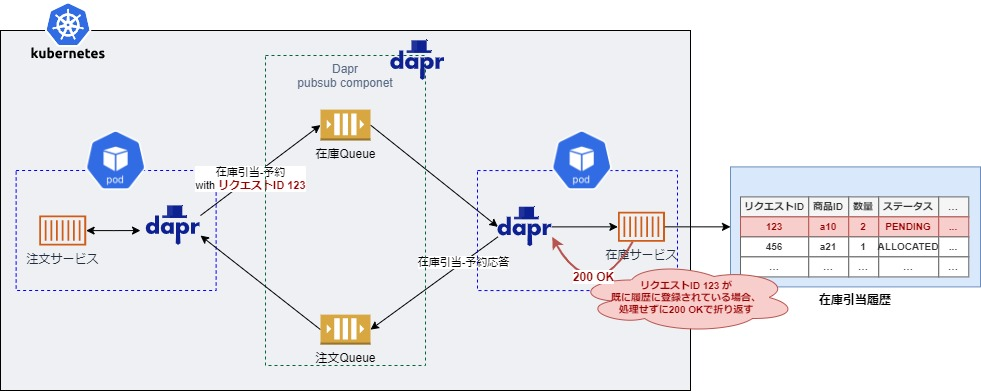

# ■ 重複リクエストの排除

サービス間通信においては、at least once 保証レベルのメッセージブローカーによる重複送信や Saga の再処理等により、同一リクエストが複数回サービスに到達する可能性がある。

リファレンスアプリケーションでは、これらのリクエストによる重複処理を抑止するため、サービスサイドで冪等制御の仕組みを導入している。

## ▽ 冪等制御
冪等性とは「同じ処理を何度繰り返したとしても、同じ結果となる」ことで、冪等制御は冪等性が保証されるよう制御を行う仕組みを指す。

リファレンスアプリケーションで導入している冪等制御は、同一リクエストが到達した場合、1度目のリクエストが処理されていることを確認し、2度目のリクエストに対しては処理を行わず(リクエストの破棄)、呼出元には正常に処理が行われた旨の結果を返す制御を行っている。

同一リクエストの判断には、リクエストに対しリクエストIDを付与し、リクエストIDが同一であれば、同一リクエストであると判断している。

具体的には以下の形で実現している。

- ① サービス呼出元(注文サービス)でリクエストIDを含めた形でリクエストを送信する。
- ② サービス呼出先(在庫サービス)で受け取ったリクエストIDを含め、業務データを履歴データベースに保持した上で、業務処理を行う。
- ③ リクエストを受け取る度に、業務処理の最初に履歴テーブルに対し、受け取ったリクエストIDを含むデータの有無を確認し、データがあった場合はそれ以上処理を行わずに、200 OK をサービス呼出元に返却する。

実装の詳細については、以下を参照。
- jp.co.ogis_ri.nautible.app.stock.exception.DuplicateRequestExceptionMapper
- (AWSの場合) jp.co.ogis_ri.nautible.app.stock.outbound.dynamodb.DynamodbStockAllocateHistoryRepositoryImpl
- (Azureの場合) jp.co.ogis_ri.nautible.app.stock.outbound.cosmosdb.CosmosdbStockAllocateHistoryRepositoryImpl 
