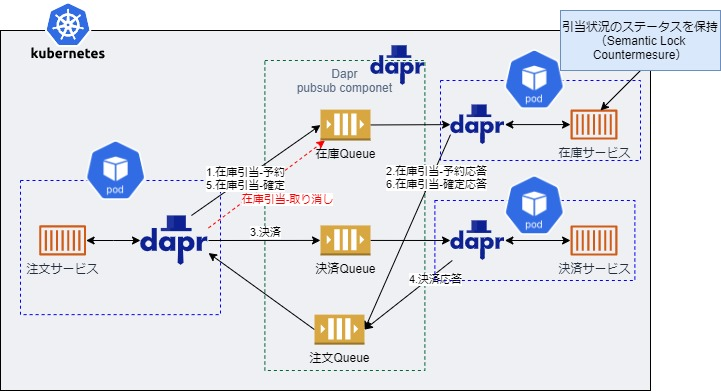

# ■ リファレンスアプリケーションにおけるサービス間通信
- 同期・非同期通信  
サービス間の通信ではRESTによる同期通信やメッセージングブローカーなどを利用して非同期通信を行う方法があります。同期通信ではすべてのサービスが同時に利用できる状態でなければならないため可用性の面でデメリットがあります。特に、マイクロサービスアーキテクチャでは複数のサービスを組み合わせて１つのAPIを実現するケースが多くなり、非同期通信を採用することで可用性の高いシステムを実現することが重要となります。  

- 非同期通信の実現方法  
リファレンスアプリケーションではマイクロサービスの開発をサポートするランタイムであるDaprを利用して非同期でプロセス間通信を実現しています。DaprはAWS SNS/SQS、GCP PUB/SUB、AzureServiceBus、Redis、Kafkaといったpub/subコンポーネントを隠蔽して、アプリケーションに機能を提供します。Daprの特徴やメリットについては[Dapr](../../../../reference/dapr/README.md "Dapr")を参照してください。

- リファレンスアプリケーションでの非同期通信処理イメージ  
以下は注文サービスの注文処理（SAGA）のサービス間通信のイメージになります。注文サービスは注文処理要求をクライアントから受け取り、在庫サービスの在庫引当処理、決済サービスの決済処理をDaprを介した非同期通信を行う事で実現しています。アプリケーションはメッセージブローカーの種類やそれぞれ固有のAPIなどを意識する必要がなく、Daprが提供するインターフェースに処理要求を行うだけで実現することができます。

- 実装の詳細については以下参照  
jp.co.ogis_ri.nautible.app.order.domain.OrderSagaManager・・・注文サービスの注文処理（SAGA実装）
jp.co.ogis_ri.nautible.app.order.outbound.rest.MessageSenderImpl#reserveAllocateStock・・・DaprのSDKを利用したPublish実装
jp.co.ogis_ri.nautible.app.stock.inbound.rest.RestStockServiceImpl#reserveAllocate・・・Daprを利用したSubscribe実装
