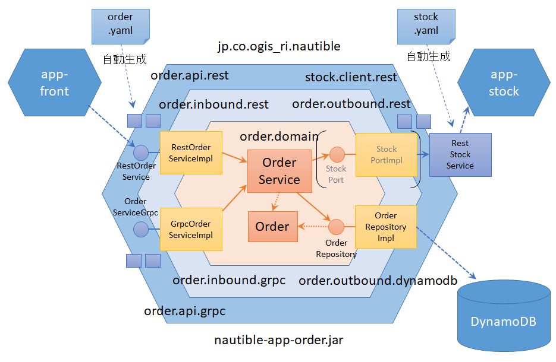

# 実装ルール

マイクロサービスアーキテクチャでは、各サービスを異なる言語やフレームワークで実装することも可能だが、nautible では、ほとんどのサービスをクラウドネイティブな Java フレームワーク Quarkus を用いて実装している。ここでは、各サービスを Java/Quarkus を用いて実装する際のルールを主に記載する。

## プロジェクト

Quarkus では、標準で Maven を用いてビルドを行う。

### プロジェクト/jarの単位について

- 作業効率やサンプル・検証実装であることを考慮し、web/domain/repository などレイヤーごとのプロジェクトの分割は行わない。
- AWS、Azure など、複数のクラウド環境に対応するため、共通部分(core)と各環境ごとのサブプロジェクトに分割する。

### プロジェクトの階層構造について

- リポジトリの直下にルートプロジェクトを配置する。

## Java のパッケージ構成

管理対象ごとのパッケージ構成は以下のルールとする。これ以外についてはプロジェクトの状態も考慮しながら柔軟に対応する。

| 管理対象         | パッケージ(例)                                 | 配置ファイル | 備考 |
| ---------------- | ---------------------------------------------- | ------------ | ---- |
| Root             | jp.co.ogis_ri.nautible.app.order               | - | |
| Domain           | jp.co.ogis_ri.nautible.app.order.domain        | Order   OrderService   OrderRepository | OrderRepository の I/F は domain パッケージに配置する。 |
| REST API + Model (自動生成) | jp.co.ogis_ri.nautible.app.order.api.rest | RestCreateOrderRequest   RestCreateOrderResponse   RestOrderService | 実装クラスは inbound.rest に配置する。 |
| gRPC API + Model (自動生成) | jp.co.ogis_ri.nautible.app.order.api.grpc | GrpcCreateOrderRequest   GrpcCreateOrderResponse   OrderServiceGrpc | OrderServiceGrpc ← Generator が Suffix に Grpc を自動でつける。 実装クラスは inbound.grpc に配置する。 |
| Inbound Adapter  | jp.co.ogis_ri.nautible.app.order.inbound       | - | |
| REST API 実装    | jp.co.ogis_ri.nautible.app.order.inbound.rest  | RestOrderServiceImpl   RestOrderMapper | |
| gRPC API 実装    | jp.co.ogis_ri.nautible.app.order.inbound.grpc  | GrpcOrderServiceImpl   GrpcOrderMapper | |
| Outbound Adapter | jp.co.ogis_ri.nautible.app.order.outbound      | - | |
| DynamoDB         | jp.co.ogis_ri.nautible.app.order.outbound.dynamodb | OrderRepositoryImpl | |
| REST Client 呼び出し | jp.co.ogis_ri.nautible.app.order.outbound.rest | RestOrderServiceImpl   RestStockMapper | |
| REST Client + Model (自動生成) | jp.co.ogis_ri.nautible.app.stock.client.rest | RestCreateStockRequest   RestCreateStockResponse   RestStockService | 相手先のパッケージ名 |

上記パッケージ構成は、ヘキサゴナルアーキテクチャの考え方をベースにしている。
ドメインは外部リソースに依存しないよう設計し、ドメインと外部リソースはアダプタで接続する。

