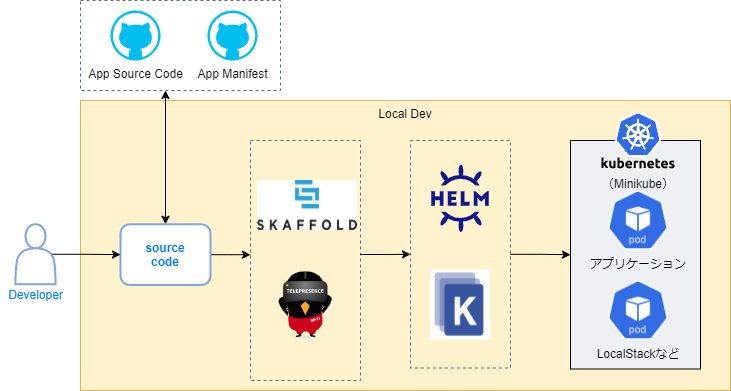

# ローカル環境での開発方法

## ローカル開発イメージ図



## 事前準備

* [dockerのインストール](https://docs.docker.com/get-docker/)
* [minikubeのインストール](https://kubernetes.io/ja/docs/tasks/tools/install-minikube/)
* [kubectlのインストール](https://kubernetes.io/ja/docs/tasks/tools/install-kubectl/)
* [skaffoldのインストール](https://skaffold.dev/docs/install/)

## skaffoldを利用した開発手順

### skaffoldのコマンドを実行して開発開始

- skaffold init ・・・実行ディレクトリ配下を解析してSkaffoldの定義ファイルskaffold.yamlを生成する。
- skaffold run ・・・ビルドからデプロイまでを1回実行する。
- skaffold dev ・・・ソースコードの変更を検知して、ビルドからデプロイを繰り返し実行する。
- skaffold debug ・・・デバッグポートを有効化してデプロイする。他は`skaffold dev`と同じ。

以下は`skaffold dev`を実行した結果

```text
>skaffold dev --port-forward
Listing files to watch...
 - XXXXXXXXXXXX.dkr.ecr.ap-northeast-1.amazonaws.com/nautible-app-ms-customer
Generating tags...
 - XXXXXXXXXXXX.dkr.ecr.ap-northeast-1.amazonaws.com/nautible-app-ms-customer -> XXXXXXXXXXXX.dkr.ecr.ap-northeast-1.amazonaws.com/nautible-app-ms-customer:9bce2ed-dirty
Found [minikube] context, using local docker daemon.
Building [XXXXXXXXXXXX.dkr.ecr.ap-northeast-1.amazonaws.com/nautible-app-ms-customer]...
~省略~
Press Ctrl+C to exit
Watching for changes...
Port forwarding service/customer-dynamodb in namespace nautible-app-ms, remote port 4566 -> address 127.0.0.1 port 4566
Port forwarding service/nautible-app-ms-customer in namespace nautible-app-ms, remote port 8080 -> address 127.0.0.1 port 8080
Port forwarding service/nautible-app-ms-customer in namespace nautible-app-ms, remote port 9000 -> address 127.0.0.1 port 9002

```

- 参考情報
  - skaffoldのport forwardにより、上記の例では、RESTが8080、gRPCが9002、localstackのdynamodbが4566ポートで公開されている。
  - ソースコードの変更をskaffoldが検知し、自動的にビルド、minikubeへデプロイする。
  - `Ctrl+C`を実行すると、デプロイ済みのコンテナを削除してからSkaffoldは停止する。

### Skaffoldの定義ファイル

Skaffoldは起動ディレクトリ直下にあるskaffold.yaml定義ファイルを読み込み、設定内容に従って動作する。

中核となる設定は下記の通り。詳細は[公式ドキュメント](https://skaffold.dev/docs/references/yaml/)を参照。

```yaml
apiVersion: skaffold/v2beta20
kind: Config
build:
  artifacts:
  - image: skaffold-example # Docker image名。この名称でビルドしタグ付けします。
                            # Dockerfileの指定を省略した場合はSkaffoldがDockerファイルを自動的に検出します。
deploy:
  kubectl:
    manifests:
      - k8s-* # デプロイ時に実行するマニフェストを指定します。ワイルドカード指定可。
```

### 便利な機能

- Port-fowardオプション  
Skaffoldのコマンド引数にport-forwardオプションを付与して実行すると、Skaffoldがアプリケーションのポートやデバッグポートを自動でport-forwardする。複数のPODを起動した場合などポート番号が重複する場合はSkaffoldが自動的にポート番号をインクリメントして重複しないように調整してから公開される。

- Debugモード  
`skaffold debug`コマンドでSkaffoldを起動することで、デバッグを有効にしてアプリケーションを起動することができる。ただし、debugオプションを付与するだけでは、デバッグモードが有効にならず、例えばJavaの場合は特定の環境変数が設定されていないとデバッグが有効にならないなど利用する言語によって前提条件があるので注意が必要。詳細については[こちら](https://skaffold.dev/docs/workflows/debug/#supported-language-runtimes)を参照。

- Profile  
 複数の環境を利用する場合などにプロファイルを活用して接続先の変更や環境差異を吸収することなどができる。環境変数、Kubernetesの接続先、ビルドパラメータなど様々な定義を行う事ができる。詳細については[公式](https://skaffold.dev/docs/environment/profiles/)を参照。

## コードの自動生成について

- REST
  openapi-generator-maven-pluginで[openapi](https://www.openapis.org/)の定義からIFを自動生成する。

## Logging

- オープントレーシング
Istioのオープントレーシング(Jaeger)を利用する。istioがオープントレーシングを実現するためのHTTPヘッダー値を生成し、Jaegerに連携する。アプリから他のサービスを呼び出す場合は、HTTPヘッダーを引き継ぐ必要がある。詳細は[ドキュメント参照](https://istio.io/latest/docs/tasks/observability/distributed-tracing/)。
- アプリケーションログと出力値
ログの検索や、解析のために必要な値をMDCを活用してログ出力できるようにするため、以下の値をMDCに設定する
  - x-request-id（istioのオープントレーシングで発行している値
  - url
  - http-method
  - gRPC-method

```text
<参考ソース>
jp.co.ogis_ri.nautible.app.customer.core.rest.RestMDCInterceptor
jp.co.ogis_ri.nautible.app.customer.core.grpc.GrpcMDCInterceptor
```

- Grafana/Prometail
  Grafanaでアプリケーションが出力したログを解析、フィルタリングするためにPrometailにjsonフォーマットのログ出力内容について定義する。定義内容の概要については[こちら](https://github.com/nautible/nautible-plugin/blob/main/observation/docs/logging.md)。

nautible-plugin\observation\promtail\application.yaml

```yaml
            - json:
                expressions:
                  level: level
                  timestamp: timestamp
                  hostName: hostName
                  message: message
                  mdc: mdc
            - json:
                expressions:
                  #can't use charactor [-]
                  x_request_id: '"x-request-id"'
                  url: url
                  http_method: '"http-method"'
                  gRPC_method: '"gRPC-method"'
                source: mdc
            - labels:
                level:
                timestamp:
                hostName:
                message:
                mdc:
                url:
                x_request_id:
                http_method:
                gRPC_method:

```

## Observation

- Prometailのメトリクス定義
  prometheusのアラートルールでエラーログ検知を行うためのメトリクス定義を行う。定義内容の概要については[こちら](https://github.com/nautible/nautible-plugin/blob/main/observation/docs/logging.md)。

nautible-plugin\observation\promtail\application.yaml

```yaml
            - metrics:
                log_error_total:
                  type: Counter
                  description: error number
                  prefix: customer_
                  source: level
                  config:
                    value: ERROR
                    action: inc

```

- Prometheusのアラートルール
Prometailで登録したメトリクスを利用し、Prometheusのアラートルールにpodの起動数とエラーログ検知のルールを定義する。
定義内容の概要については[こちら](https://github.com/nautible/nautible-plugin/blob/main/observation/docs/custom-rule.md)。

nautible-plugin\observation\rules\base\customer-rule.yaml

```yaml
spec:
  groups:
  - name: rules-customer-alert1
    rules:
    - alert: ApplicationDown
      expr: >-
          100 * (count(up == 0) BY (job, namespace, service) / count(up) BY (job, namespace, service)) > 10
      for: 5m
      labels:
        severity: critical
      annotations:
        message: >-
          {{ $labels.job }}/{{ $labels.service }} targets in {{ $labels.namespace }} namespace are down.
  - name: rules-customer-alert2
    rules:
    - alert: ApplicationError
      expr: >-
          ( count (customer_log_error_total) > 0 ) or ( count (customer_log_severe_total) > 0 )
      for: 1m
      labels:
        severity: critical
      annotations:
        message: >-
          {{ $labels.job }}/{{ $labels.service }} targets in {{ $labels.namespace }} namespace are application error.
```

## マニフェスト管理プロジェクトのフォルダ基本構成

アプリケーションのマニフェストはkustomizeで管理している。baseに全環境共通の定義、overlaysに各環境固有の定義（差分）を行い、kustomizeでマージした結果を各環境に適用している。

```text
nautible-app-ms-xxx-manifest
  │
  ├─base     ・・・全環境共通のマニフェストを管理する。
  │
  └─overlays        ・・・環境毎の差分のマニフェストを管理する。
      ├─dev         ・・・開発環境のマニフェストを管理する。
      ├─local-dev   ・・・ローカル開発環境のマニフェストを管理する。
      └─prod        ・・・本番環境のマニフェストを管理する。
```

## AWS ECRアクセスと社内Proxyの認証について

minikubeからAWSのECRにアクセスする場合に以下の方法で社内Proxy認証を通す事ができる。
- [minikubeのregistry-credsを有効にする](https://minikube.sigs.k8s.io/docs/tutorials/configuring_creds_for_aws_ecr/#configuring-and-enabling-the-registry-creds-addon)

```bash
minikube addons configure registry-creds
```

```bash
minikube addons enable registry-creds
```

- registry-credsを含むすべてのpodの環境変数にProxy設定を行う
  - [nautible-admission-webhook(Tool）](https://github.com/nautible/nautible-admission-webhook)ページの適用方法にしたがってnautible-admission-webhookを適用する。
  その時に、以下の環境変数をpodに適用するよう設定する。

```text
HTTPS_PROXY=http://${USER_ID}:${PW}@${PROXY_HOST}:${PROXY_PORT}
HTTP_PROXY=http://${USER_ID}:${PW}@${PROXY_HOST}:${PROXY_PORT}
NO_PROXY=127.0.0.1,localhost,${その他各環境毎に必要な値を追加}
```

上記$で始まる変数は、各環境に合わせて書き換えて適用する。

## minikubeの注意点

* minikubeはデフォルトでminikube組み込みのDokcerデーモンからimageを取得する。以下のコマンドを実行する事で、skaffoldがビルドしたDocker imageをminikubeの参照先に配置する事ができる。

Windowsの場合

```text
@FOR /f "tokens=*" %i IN ('minikube -p minikube docker-env') DO @%i
```

Macの場合

```bash
eval $(minikube docker-env)
```

* 上記ローカル環境での開発方法でlocalstackを実行しているdockerは、ホスト上で起動しているdockerコンテナとなる。minikubeの組み込みのDockerでは無いので注意する。
