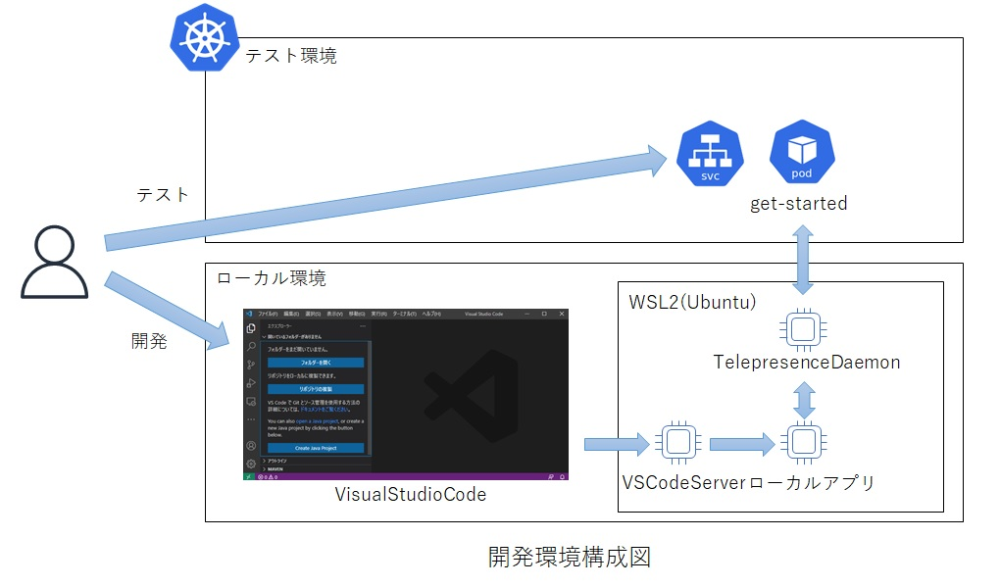
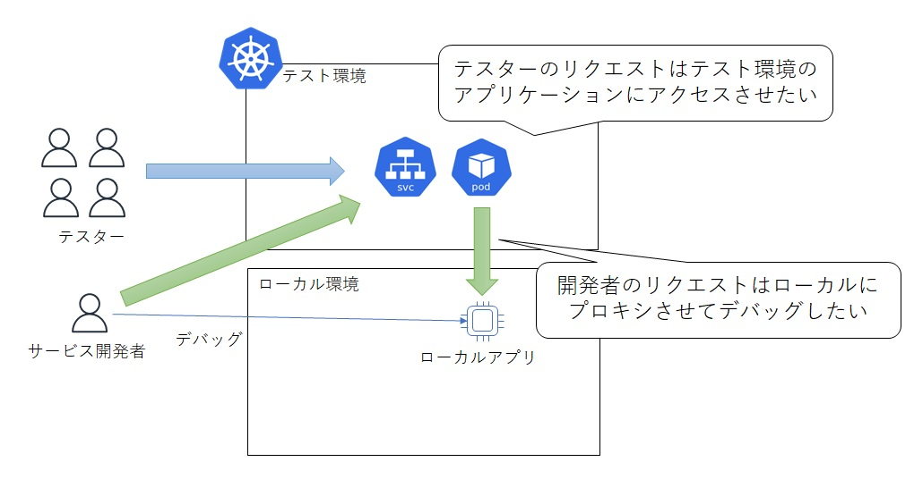

# Telepresence

サービスをローカルで開発しながら、そのサービスをテスト環境等のKubernetesクラスタに接続する  
ローカルで開発しながらテスト環境のシークレットやDB等のリソースにアクセスできるため、開発効率を上げることができる  

## アーキテクチャ図


出典）https://www.telepresence.io/docs/latest/reference/architecture/


## 前提条件

- windows10
- WSL2(Ubuntu20.04)

※ 2021/8/11にリリースされたv2.4.0からはWindowsネイティブのクライアントも提供されているためWSL2を利用しなくても動作可能  
※ Mac/Linuxについては[公式ドキュメント](https://www.telepresence.io/docs/latest/install/)参照

## 事前準備

WSL2上にkubectlを導入し、kubernetesへアクセスできるようにする（クラウドを利用する際はクラウドのCLI（AWS上だとawscli等）も必要に応じて導入）

## Telepresenceのインストール

導入の手順は下記の３ステップ

(1) クライアント（WSL2 Ubuntu）にTelepresenceCLIを導入

(2) KubernetesにTraffic Managerを導入

(3) ローカルへプロキシしたいサービスにTraffic Agentを導入

#### (1) クライアント（WSL2 Ubuntu）にTelepresenceCLIを導入

```
$ curl -fL https://app.getambassador.io/download/tel2/linux/amd64/latest/telepresence -o telepresence
$ chmod 755 telepresence
$ sudo mv telepresence /usr/bin/.
```

#### (2) KubernetesにTraffic Managerを導入

Traffic ManagerはTelepresenceCLIからTelepresenceDaemonを起動すると初回に自動で導入される。

TelepresenceDaemonは、`telepresence connect` とすることで起動する。

```
$ telepresence connect
Launching Telepresence Root Daemon
Launching Telepresence User Daemon
Connected to context example (https://xxxxxxxxxxxxxxxxxxxxxxxxx.xxx.ap-northeast-3.eks.amazonaws.com)
```

Kubernetes側の状態を確認すると、ambassadorネームスペースと、その中にService、Deployment、Replicaset、Podが導入されていることが確認できる。

```
$ kubectl get namespaces
NAME                          STATUS   AGE
ambassador                    Active   5m29s
...

$ kubectl get all -n ambassador
NAME                                  READY   STATUS    RESTARTS   AGE
pod/traffic-manager-c6dbb7999-6cwbt   1/1     Running   0          5m46s

NAME                      TYPE        CLUSTER-IP       EXTERNAL-IP   PORT(S)    AGE
service/agent-injector    ClusterIP   10.100.234.153   <none>        443/TCP    5m47s
service/traffic-manager   ClusterIP   None             <none>        8081/TCP   5m47s

NAME                              READY   UP-TO-DATE   AVAILABLE   AGE
deployment.apps/traffic-manager   1/1     1            1           5m48s

NAME                                        DESIRED   CURRENT   READY   AGE
replicaset.apps/traffic-manager-c6dbb7999   1         1         1       5m48s
```

#### (3) ローカルへプロキシしたいサービスにTraffic Agentを導入

まず、`telepresence list`で導入したいネームスペースの導入状況を確認する。

```
$ telepresence list -n default
getting-started-deployment: ready to intercept (traffic-agent not yet installed)
```

次に`telepresence intercept`で実際にgetting-started-deploymentにTraffic Agentを導入する。

```
$ telepresence intercept getting-started-deployment --port 8080:8080
Using Deployment getting-started-deployment
intercepted
    Intercept name         : getting-started-deployment
    State                  : ACTIVE
    Workload kind          : Deployment
    Destination            : 127.0.0.1:8080
    Service Port Identifier: 8080
    Volume Mount Point     : /tmp/telfs-787085176
    Intercepting           : all TCP connections
```

getting-startedのPodを見てtraffic-agentコンテナがデプロイされていることを確認する。

```
$ kubectl get pods
NAME                                          READY   STATUS    RESTARTS   AGE
getting-started-deployment-5dbb8f4964-ddls6   2/2     Running   0          44h
```

また、Pod内の詳細情報を確認すると、アプリケーション以外にtraffic-agentコンテナがデプロイされていることがわかります。

```
$ kubectl describe pods getting-started-deployment-5dbb8f4964-ddls6

...
Containers:
  getting-started:
    Container ID:   docker://02661e1eac4c1c05d07e853da25a736378244d132cbcdbbb66680df04ca09be5
...
  traffic-agent:
    Container ID:  docker://72ea9866712059fd886e4904607834e4bedbc0168029571d45f4a0387ba57792
    Image:         docker.io/datawire/tel2:2.4.0
    Image ID:      docker-pullable://datawire/tel2@sha256:f88e16070521acfaa592b048f7bb431f9ef14268f51b0b7fd83978c0ec800391
    Port:          9900/TCP
    Host Port:     0/TCP
...
```

この状態でkubernetes上の対象サービスにアクセスすると、ローカルのアプリケーションに転送される。

## Windows版Telepresenceでのデバッグ（VisualStudioCode）

Windows版TelepresenceはWSL2上で起動するため、VisualStudioCodeもWSL2から起動することでデバッグが可能となる。

### 構成図



### 手順

- WSL2を起動し、プロジェクトフォルダまで移動
- 「code .」でVisualStudioCodeを起動（初回はダウンロードあり）
- VisualStuioCodeでアプリケーションをデバッグ実行

## クラスタで利用している環境変数をローカルで利用

--env-fileを付与すると指定したファイル名に環境変数が出力されるので、それをローカル側で読み込ませることでKubernetesクラスタのPodと同一の設定をローカルのPodに読み込ませることができる。

```
$ telepresence intercept <サービス名> --port <ローカルポート>:<リモートポート> --env-file=<ファイル名>
```

指定したファイルを見ると下記のように環境変数の一覧が出力されているので、これをローカルアプリケーションにロードする。

```
GETTING_STARTED_SERVICE_PORT=tcp://172.20.158.40:8080
GETTING_STARTED_SERVICE_PORT_8080_TCP=tcp://172.20.158.40:8080
GETTING_STARTED_SERVICE_PORT_8080_TCP_ADDR=172.20.158.40
GETTING_STARTED_SERVICE_PORT_8080_TCP_PORT=8080
GETTING_STARTED_SERVICE_PORT_8080_TCP_PROTO=tcp
GETTING_STARTED_SERVICE_SERVICE_HOST=172.20.158.40
GETTING_STARTED_SERVICE_SERVICE_PORT=8080
GETTING_STARTED_SERVICE_SERVICE_PORT_HTTP=8080
...
```

## GitOpsとの併用

ArgoCDなどを用いてGitOpsでデプロイしている場合、デプロイ後のPodにTraffic Agentを直接導入するとGitと状態が異なることになるため、Mutating Webhookを利用してPodにTraffic Agentを導入する。

Mutating Webhookの利用はPodのアノテーションで指定。

### アノテーションの設定

```
 spec:
   template:
     metadata:
       labels:
         service: your-service
       annotations:
         telepresence.getambassador.io/inject-traffic-agent: enabled
     spec:
       containers:
```

### Serviceのポート名を確認

```
spec:
  ports:
  - name: http
    port: 8080
    protocol: TCP
    targetPort: 8080
```

### interceptはポート名で指定

```
telepresence intercept <サービス名> --port <ローカルポート>:http
```

詳しくは[ドキュメントのMutating Webhook](https://www.telepresence.io/docs/latest/reference/cluster-config/)を参照

## 特定のリクエストだけプロキシする

TelepresenceV2ではHTTP層での振り分けが可能なため、特定のリクエストだけプロキシさせることができる。

ただし、この振り分け機能は非OSS版のTraffic Agentのみ利用可能（Telepresenceの開発元であるAmbassador Labsが提供しているTraffic AgentにはデフォルトのOSS版Traffic Agentと非OSS版のTraffic Agentがある）

※ 非OSS版のTraffic Agentを利用するためにはAmbassador Cloudへの登録が必要（Ambassador Cloudの利用に関しましては各自の責任で行ってください）

### 構成図



--http-matchフラグを利用して振り分けを実施。

```
$ telepresence intercept <サービス名> --port <ローカルポート>:<リモートポート> --http-match=<ヘッダ情報>
```

--http-matchフラグを付与すると自動的に非OSS版のコンテナがPodに付与される。（非OSS版のコンテナを利用する場合はAmbassador Cloudへの登録が必須となるため、未ログイン状態の場合はここでログインを要求される。）

Ambassador Cloudへログインして非OSS版のコンテナがPodにデプロイされると、特定のリクエストのみがローカルにプロキシされ、それ以外は通常通りテスト環境のPodへ通信が流れる。

詳しくは[ドキュメントのIntercepts](https://www.telepresence.io/docs/latest/reference/intercepts/)を参照

## プロキシ設定の解除

Traffic Agentを残したままプロキシを解除

```
$ telepresence leave <サービス名>
```

Traffic Agent自体削除

```
$ telepresence uninstall --agent <サービス名>
```

※ `telepresence uninstall` には他にも全Traffic Agentを削除する&#45;&#45;all-agentsやTraffic Managerも削除する&#45;&#45;everythingフラグもある。